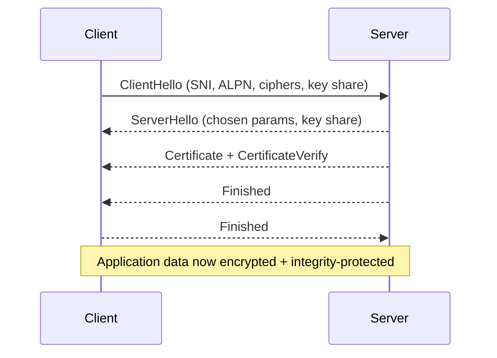
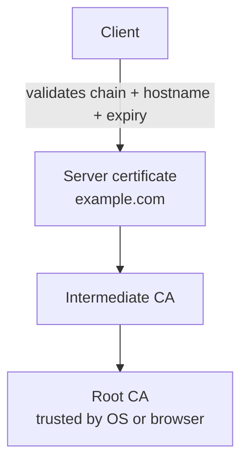
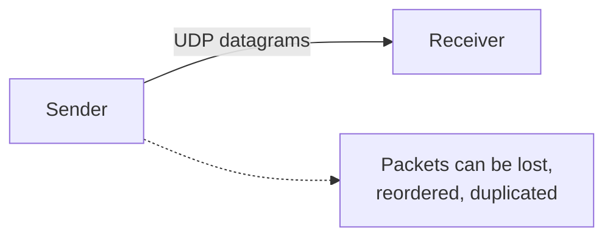
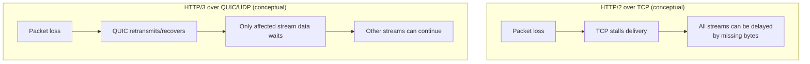
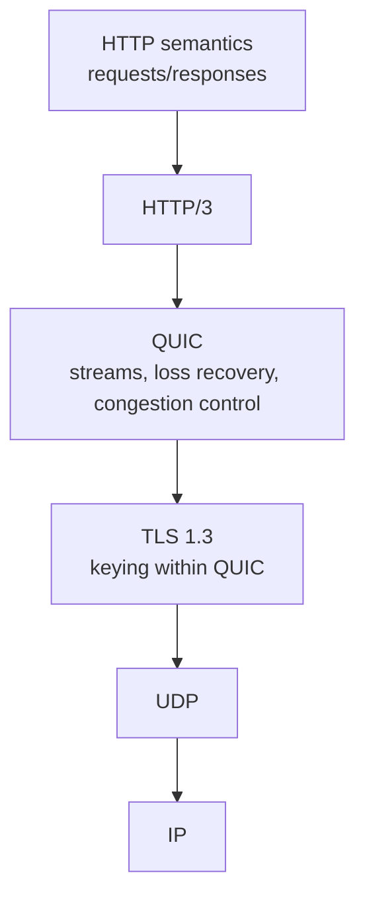

# TLS, UDP, QUIC, and HTTP/3 (Reference Notes)

**Last Updated:** 2026-03-30

This is a quick reference for the concepts that matter most when working with HTTP/3 in this project.

---

## 1. TLS (Transport Layer Security)

TLS is the standard security layer used on the Internet. It provides:

- **Confidentiality:** outsiders cannot read traffic (encryption)
- **Integrity:** outsiders cannot silently modify traffic (tamper detection)
- **Authentication:** the client can verify the server identity (certificates)

### 1.1 TLS 1.3 Handshake (Conceptual)

At a high level, TLS is:

1. Agree on capabilities (versions/ciphers)
2. Authenticate the server (certificate chain)
3. Derive shared symmetric keys
4. Encrypt application data using those symmetric keys

Notes:

- **SNI** (Server Name Indication) tells the server which hostname the client wants.
- **ALPN** (Application-Layer Protocol Negotiation) selects the HTTP version family (commonly `h2` for HTTP/2, `h3` for HTTP/3).
- TLS 1.3 can support **0-RTT** on resumed sessions (faster), but early data can be replayed, so it must only be used for safe/idempotent requests.

### 1.2 Certificates and Trust

A certificate binds a **public key** to an identity (usually a domain name) and is signed by a Certificate Authority (CA). Clients validate:

- The certificate chain reaches a trusted root CA
- The certificate is not expired
- The hostname matches (SAN / subject alternative names)

### 1.3 TLS and HTTP/3

- HTTP/1.1 and HTTP/2 typically run on **TCP**, with TLS layered on top (HTTPS).
- HTTP/3 runs over **QUIC**, and QUIC uses **TLS 1.3** as part of its handshake and keying.
- Practically: there is no “HTTP/3 without TLS”.

---

## 2. UDP (User Datagram Protocol)

UDP is a transport protocol that sends independent packets called **datagrams**.

What UDP provides:

- **Ports** (so multiple apps can share an IP)
- **Checksums** (detect corruption)

What UDP does not provide (unlike TCP):

- No built-in connection setup
- No guaranteed delivery (loss can occur)
- No guaranteed ordering (reordering can occur)
- No retransmission
- No congestion control / flow control at the UDP layer

---

## 3. QUIC (Runs Over UDP)

QUIC is a modern transport protocol implemented largely in user space and carried over UDP.

QUIC adds (at the QUIC layer, not at UDP):

- Connection semantics (with a handshake)
- Encryption (via TLS 1.3)
- Reliability and loss recovery (as needed)
- Congestion control
- Multiple independent streams
- **Connection migration** (survive IP/port changes, e.g. Wi-Fi to LTE)

### 3.1 Why HTTP/3 Uses UDP

HTTP/3 uses QUIC, and QUIC uses UDP, mainly to:

- Avoid TCP head-of-line blocking across streams
- Improve behavior under packet loss for multi-stream apps
- Enable connection migration

---

## 4. HTTP/3 (Runs Over QUIC)

HTTP/3 is the HTTP semantics (requests/responses) mapped onto QUIC streams.

The stack looks like:

---

## 5. Practical Implications for “Going Live”

### 5.1 Non-negotiables for real HTTP/3 in production

- **Valid TLS certificate** for your public hostname
- **Inbound UDP** open on the public port (commonly `443/udp`)
- A hosting setup that does not break or terminate QUIC in a way that defeats what you’re benchmarking

### 5.2 Expected behavior

- Some networks will block QUIC; clients should fall back to HTTP/2.
- HTTP/3 benefits tend to show up in:
  - concurrent loads
  - long-lived streams (SSE-like behavior)
  - lossy/jittery mobile networks

---

## 6. How This Relates to This Repo (Today)

- The app exposes `http://...:5000` (HTTP/1.1).
- It can expose `https://...:5001` (HTTP/1.1 + HTTP/2 + HTTP/3) when a localhost dev cert exists and QUIC is supported.
- The app does not yet emit `Alt-Svc` headers; HTTP/3 testing is done by forcing protocol on the client.
