# Technical Requirements Document (TRD)
## Live Match Companion App
**Version:** 1.0  
**Status:** Draft  
**Last Updated:** 2026-03-30

---

Phased execution plans live in `docs/plans/README.md`.

## Table of Contents
1. [System Overview](#1-system-overview)
2. [Architecture](#2-architecture)
3. [Technology Stack](#3-technology-stack)
4. [External APIs](#4-external-apis)
5. [Backend Requirements (.NET 10)](#5-backend-requirements-net-10)
6. [Mobile Requirements (Kotlin Android)](#6-mobile-requirements-kotlin-android)
7. [HTTP/3 Implementation](#7-http3-implementation)
8. [Data Models](#8-data-models)
9. [API Contract](#9-api-contract)
10. [Error Handling & Resilience](#10-error-handling--resilience)
11. [Security Requirements](#11-security-requirements)
12. [Infrastructure](#12-infrastructure)
13. [Testing Strategy](#13-testing-strategy)

---

## 1. System Overview

### 1.1 High-Level System Diagram

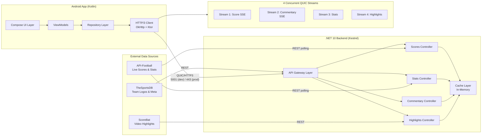

### 1.2 Deployment Overview

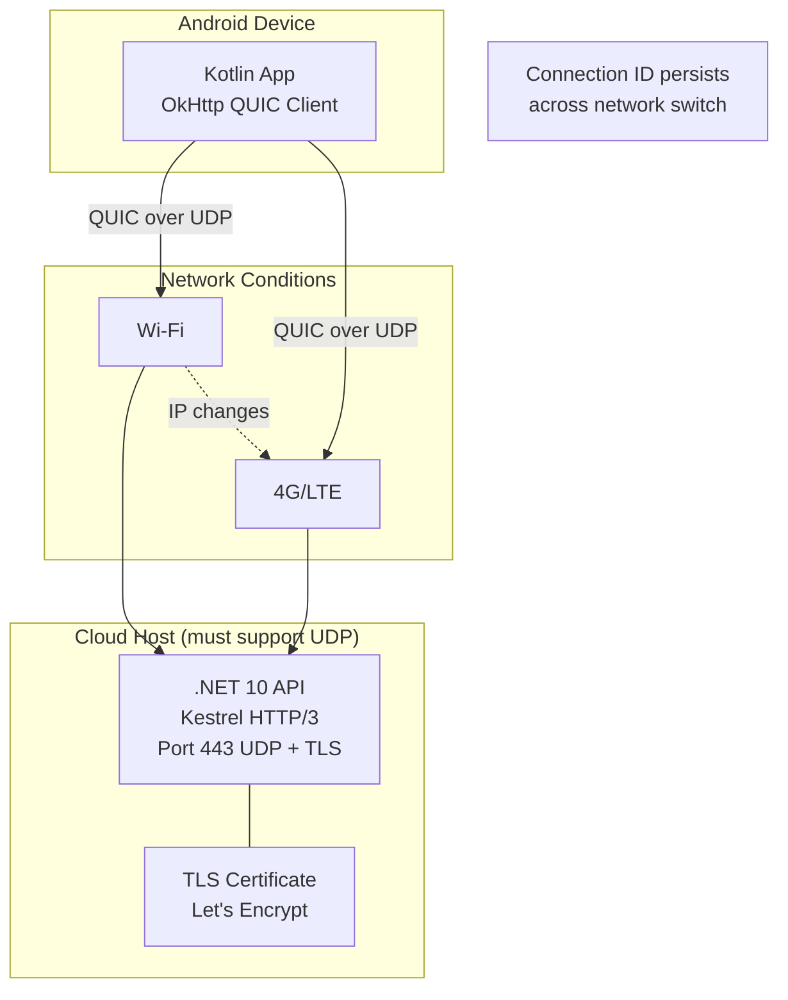

### 1.3 Current Repository Snapshot (As Of 2026-03-30)

This repo currently contains a minimal backend only.

Environment (devcontainer):

- OS: Ubuntu 24.04 (container)
- .NET SDK: 10.0.200
- Target framework: `net10.0`

Backend behavior today:

- Listens on `http://0.0.0.0:5000` (HTTP/1.1).
- Listens on `https://0.0.0.0:5001` (HTTP/1.1 + HTTP/2 + HTTP/3) only if a valid localhost dev certificate is found and QUIC is supported in the runtime environment.
- Uses API-Football for real live-match data when configured. If the API key is missing, the live match endpoints return 503.

Implemented endpoints today:

- `GET /` (service info)
- `GET /health`
- `GET /api/live-matches`
- `GET /api/live-matches/{id}`

---

## 2. Architecture

### 2.1 Architecture Pattern

| Layer | Pattern | Reason |
|---|---|---|
| Android | MVVM + Repository | Separation of concerns, testability |
| Backend | Layered MVC | Clear routing, middleware chain |
| Data flow | Reactive streams (Flow/SSE) | Real-time push from server |
| Caching | In-memory (IMemoryCache) | Reduce external API calls, stay within free tiers |

### 2.2 Layered Architecture — Android

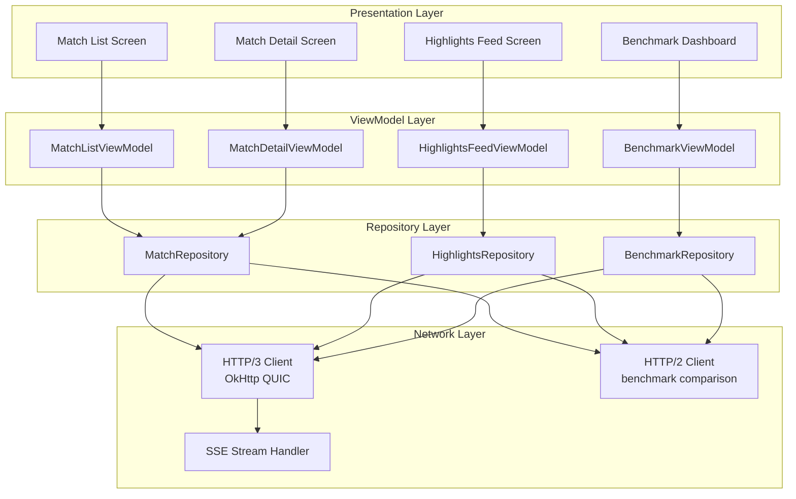

### 2.3 Backend Layer Architecture

```mermaid
graph TD
    subgraph Request["Incoming Request"]
        REQ[QUIC/HTTP3 Request]
    end

    subgraph Middleware["Middleware Pipeline"]
        CORS[CORS Middleware]
        LOG[Request Logging]
        CACHE[Cache Check]
        AUTH[Alt-Svc Header Injection\n(planned)]
    end

    subgraph Controllers["Controllers"]
        SC[ScoresController]
        STC[StatsController]
        CC[CommentaryController]
        HC[HighlightsController]
        BENCH[BenchmarkController]
    end

    subgraph Services["Service Layer"]
        SS[ScoresService]
        STS[StatsService]
        CS[CommentaryService]
        HS[HighlightsService]
    end

    subgraph External["External APIs"]
        AF[API-Football]
        SB[ScoreBat]
    end

    REQ --> CORS --> LOG --> CACHE --> AUTH
    AUTH --> SC & STC & CC & HC & BENCH
    SC --> SS --> AF
    STC --> STS --> AF
    CC --> CS
    HC --> HS --> SB
```

---

## 3. Technology Stack

### 3.1 Backend

| Component | Technology | Version | Reason |
|---|---|---|---|
| Runtime | .NET | 10.0 | Native HTTP/3 support in Kestrel |
| Web framework | ASP.NET Core | 10.0 | Built-in SSE, minimal APIs |
| HTTP server | Kestrel | 10.0 | QUIC/HTTP3 via `HttpProtocols.Http1AndHttp2AndHttp3` |
| TLS | TLS 1.3 | — | Required by QUIC spec |
| Caching | IMemoryCache | Built-in | Rate limit buffer for free API tiers |
| HTTP client | HttpClient + IHttpClientFactory | Built-in | Calls to external APIs |
| Serialisation | System.Text.Json | Built-in | Fast, allocation-friendly |

### 3.2 Android

| Component | Technology | Version | Reason |
|---|---|---|---|
| Language | Kotlin | 1.9+ | Modern, coroutine-native |
| UI | Jetpack Compose | Latest stable | Declarative, reactive |
| HTTP client | OkHttp | 5.0.0-alpha | HTTP/3 / QUIC support |
| HTTP client wrapper | Ktor Client (OkHttp engine) | 2.3.x | Kotlin-idiomatic API |
| Video player | ExoPlayer (Media3) | 1.3.x | HLS, streaming, ExoPlayer |
| DI | Hilt | 2.x | Kotlin-native DI |
| Async | Kotlin Coroutines + Flow | 1.7.x | SSE stream as Flow |
| Navigation | Navigation Compose | Latest | Screen routing |
| Charts | Vico / MPAndroidChart | Latest | Benchmark latency graphs |

---

## 4. External APIs

### 4.1 API Summary

| API | Purpose | Free Tier | Auth |
|---|---|---|---|
| API-Football (api-sports.io) | Live scores, fixtures, stats, lineups | 100 requests/day | API Key (header) |
| ScoreBat Video API | Goal highlight embed URLs | Unlimited (basic feed) | None (basic) |
| TheSportsDB | Team logos, competition metadata | Free (Patreon tier) | None |

### 4.2 API Data Flow

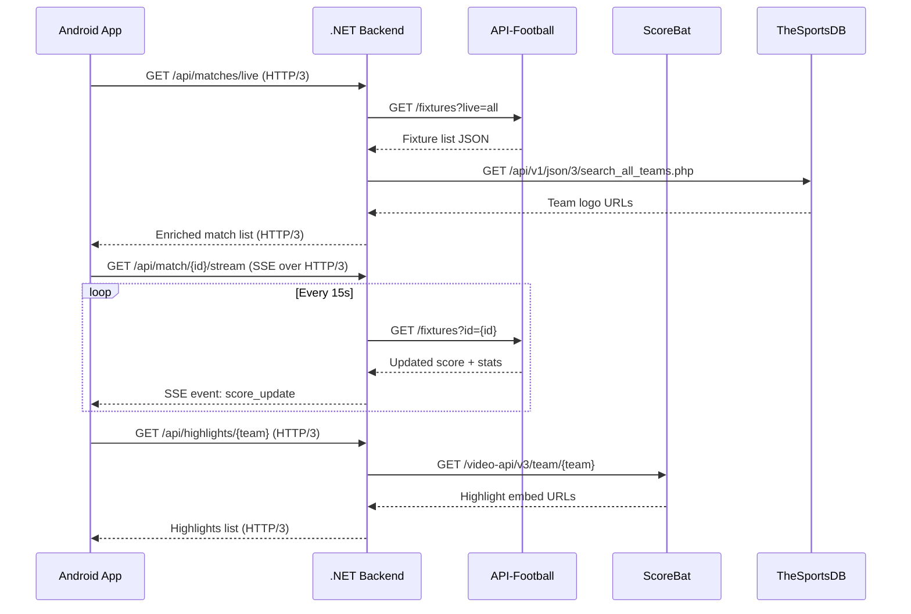

### 4.3 Caching Strategy

| Data Type | Cache Duration | Reason |
|---|---|---|
| Live score | 10 seconds | Balance freshness vs API quota |
| Player stats | 30 seconds | Stats change less frequently |
| Team logos | 24 hours | Static assets |
| Highlights | 5 minutes | New clips added infrequently |
| Fixtures list | 60 seconds | Upcoming matches don't change fast |

---

## 5. Backend Requirements (.NET 10)

### 5.1 Kestrel HTTP/3 Configuration

```mermaid
flowchart TD
    K[Kestrel Server Starts]
    K --> P1[Port 5000\nHTTP/1.1\nTCP]
    K --> P2[Port 5001\nHTTP/1.1 + HTTP/2 + HTTP/3\nTCP + UDP]
    P2 --> TLS[TLS 1.3 Certificate\nRequired for QUIC]
    TLS --> ALT[Alt-Svc Header\n(planned for discovery)]
    ALT --> NOTE["Tells clients:\n'HTTP/3 available on :5001'"]
```

### 5.2 Endpoints

#### 5.2.1 Current Endpoints

| Method | Path | Protocol | Description |
|---|---|---|---|
| GET | `/api/live-matches` | HTTP/2 or HTTP/3 | List live matches (API-Football; returns 503 if not configured) |
| GET | `/api/live-matches/{id}` | HTTP/2 or HTTP/3 | Get one match (API-Football; returns 503 if not configured) |

#### 5.2.2 Target (Planned) Endpoints

| Method | Path | Protocol | Description |
|---|---|---|---|
| GET | `/api/matches/live` | HTTP/3 | All currently live matches |
| GET | `/api/matches/upcoming` | HTTP/3 | Next 24h fixtures |
| GET | `/api/match/{id}/stream` | SSE over HTTP/3 | Real-time score + events |
| GET | `/api/match/{id}/stats` | HTTP/3 | Player & team statistics |
| GET | `/api/highlights/feed` | HTTP/3 | Recent highlights (all leagues) |
| GET | `/api/highlights/{team}` | HTTP/3 | Team-specific highlights |
| GET | `/api/benchmark/ping` | HTTP/3 + HTTP/2 | Latency test endpoint |
| GET | `/api/benchmark/payload/{kb}` | HTTP/3 + HTTP/2 | Payload size test |

### 5.3 SSE Stream Design

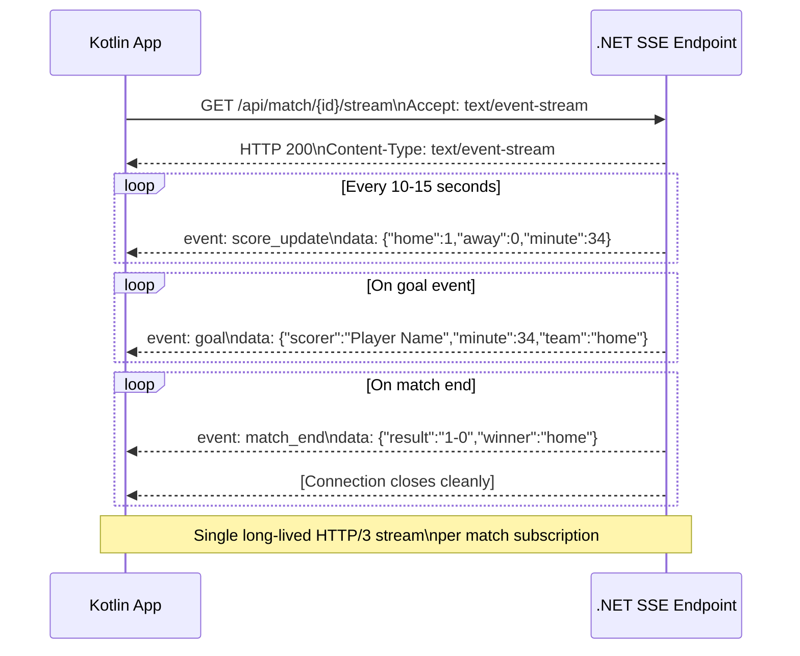

---

## 6. Mobile Requirements (Kotlin Android)

### 6.1 Screen Map

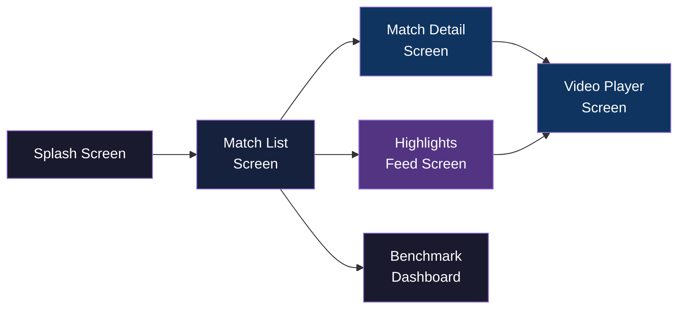

### 6.2 Match Detail — Concurrent Stream Loading

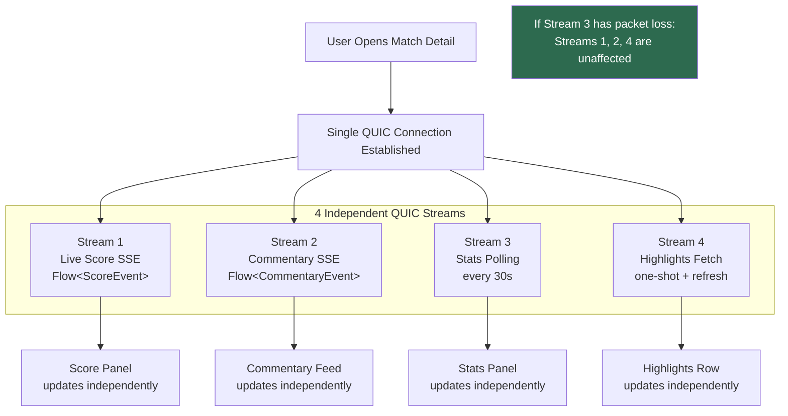

### 6.3 HTTP Client Selection Logic

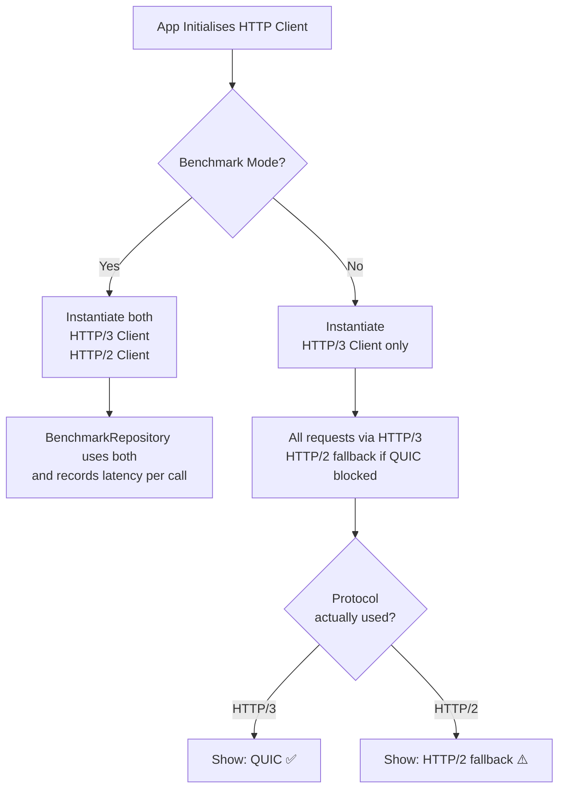

### 6.4 Network Migration Handling

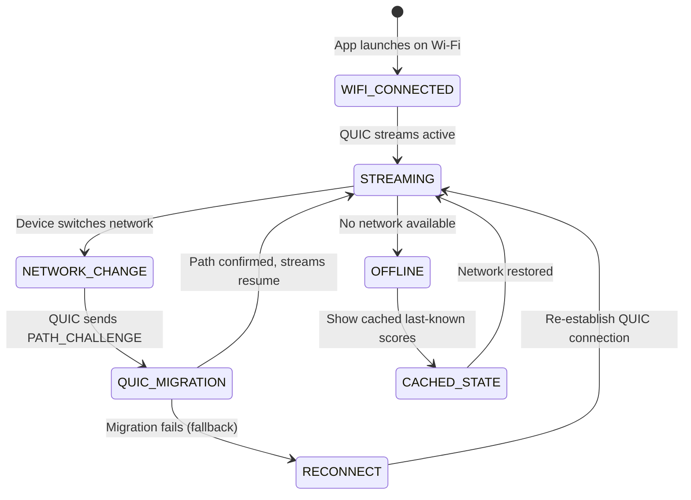

---

## 7. HTTP/3 Implementation

### 7.1 QUIC Handshake Flow

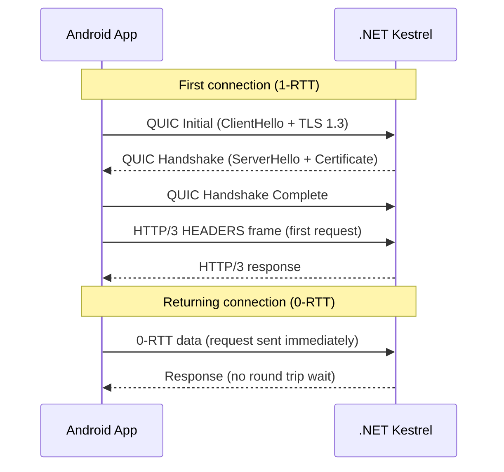

### 7.2 HTTP/3 vs HTTP/2 — Head-of-Line Blocking

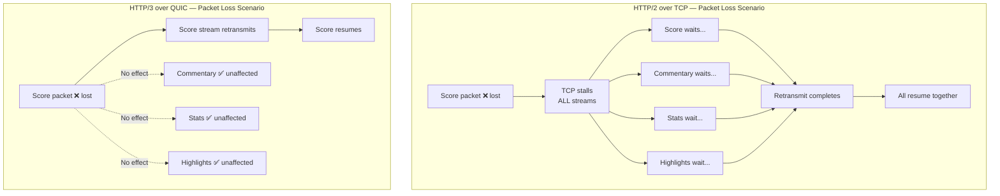

---

## 8. Data Models

### 8.1 Core Entities

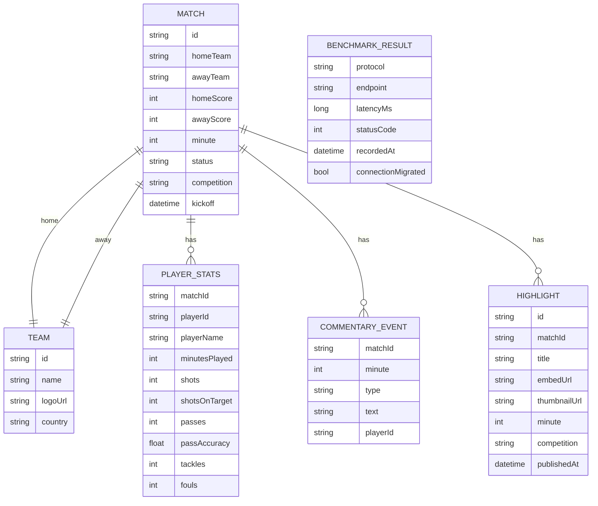

---

## 9. API Contract

### 9.1 Response — Live Match List

```
GET /api/matches/live
Protocol: HTTP/3
Response: 200 OK

{
  "matches": [
    {
      "id": "string",
      "homeTeam": { "id": "string", "name": "string", "logoUrl": "string" },
      "awayTeam": { "id": "string", "name": "string", "logoUrl": "string" },
      "homeScore": 0,
      "awayScore": 0,
      "minute": 0,
      "status": "LIVE | UPCOMING | FT",
      "competition": "string",
      "kickoff": "ISO8601"
    }
  ],
  "meta": {
    "protocol": "HTTP/3",
    "cachedAt": "ISO8601",
    "source": "api-football"
  }
}
```

### 9.2 SSE Stream Events

```
GET /api/match/{id}/stream
Accept: text/event-stream
Protocol: HTTP/3

# Score update event
event: score_update
data: {"homeScore":1,"awayScore":0,"minute":34}

# Goal event
event: goal
data: {"scorer":"Player Name","team":"home","minute":34,"assistBy":"Assist Name"}

# Stats update event
event: stats_update
data: {"possession":{"home":58,"away":42},"shots":{"home":7,"away":3}}

# Commentary event
event: commentary
data: {"minute":34,"text":"GOAL! A player scores!","type":"GOAL"}

# Match end
event: match_end
data: {"result":"1-0","winner":"home","minute":90}
```

---

## 10. Error Handling & Resilience

### 10.1 Error & Recovery Flow

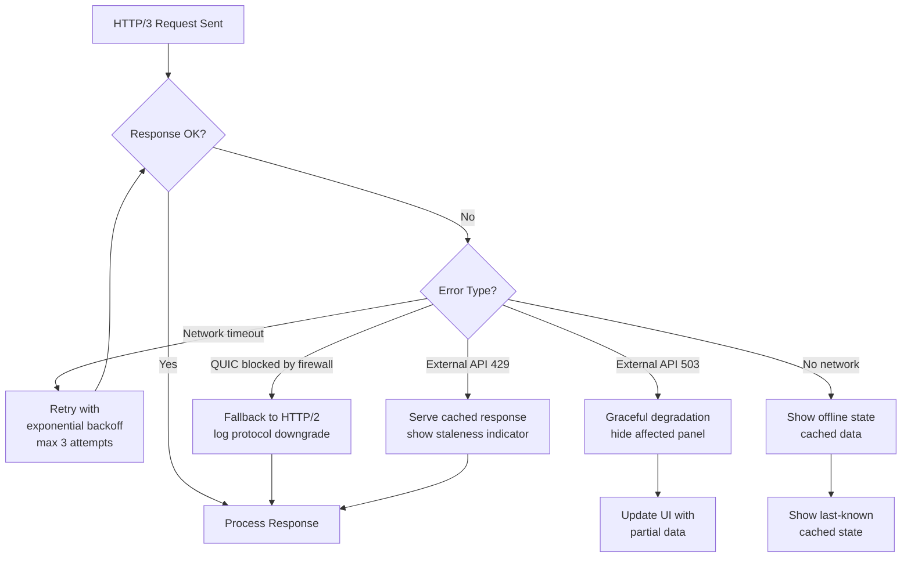

### 10.2 Stream Failure Isolation

Individual QUIC stream failures must not crash the app or affect other streams:

| Stream | Failure Behaviour |
|---|---|
| Score stream fails | Show last known score, add stale indicator |
| Commentary stream fails | Hide commentary panel, no crash |
| Stats stream fails | Show skeleton state, retry silently |
| Highlights stream fails | Show "No highlights yet", no crash |
| All streams fail | Show offline mode with cached match data |

---

## 11. Security Requirements

| Requirement | Detail |
|---|---|
| Transport security | TLS 1.3 mandatory (enforced by QUIC) |
| API keys | Stored in environment variables (for example `ApiFootball__ApiKey`), never in source code |
| Certificate | Valid TLS cert required on deployed server (Let's Encrypt) |
| Local dev cert | .NET dev certificate for localhost testing |
| No PII collected | App collects no user data in v1.0 |
| API key rotation | Keys stored in environment variables; local `.env` is optional (must be gitignored if used) |

---

## 12. Infrastructure

Go-live definitions and rollout checklist live in `docs/GO-LIVE.md`.

### 12.1 Deployment Architecture

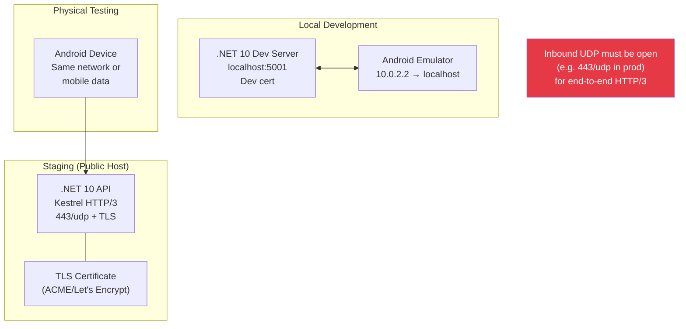

### 12.2 Repository Structure

```
http3-sports-api/
├── Program.cs
├── LiveMatchApi.csproj
├── LiveMatchApi.http
├── appsettings.json
├── appsettings.Development.json
├── Models/
├── Services/
├── Properties/
├── docs/
│   ├── PRD-LiveSportsApp.md
│   ├── TRD-LiveSportsApp.md
│   ├── GO-LIVE.md
│   ├── TLS-UDP-QUIC-HTTP3.md
│   └── plans/
└── results/
    └── benchmarks.md
```

---

## 13. Testing Strategy

### 13.1 Test Types

| Test Type | What is Tested | Tool |
|---|---|---|
| Unit | Services, repositories, ViewModels | xUnit (.NET), JUnit (Kotlin) |
| Integration | .NET endpoints respond correctly | WebApplicationFactory |
| Protocol | HTTP/3 actually negotiated | Wireshark / Charles Proxy |
| Benchmark | HTTP/2 vs HTTP/3 latency | In-app dashboard |
| Network simulation | Packet loss, network switch | Android Network Link Conditioner |
| Chaos | Kill individual streams | Block one API mid-session manually |

### 13.2 Benchmark Test Plan

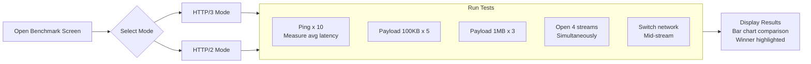

### 13.3 Acceptance Criteria

| Scenario | Expected Result |
|---|---|
| App connects to server | HTTP/3 negotiated (verify via protocol label) |
| Match detail opens | All 4 panels load within 3 seconds |
| Network switches mid-match | Score stream continues within 1 second |
| One stream has packet loss | Other 3 streams continue unaffected |
| HTTP/3 vs HTTP/2 benchmark | HTTP/3 shows lower latency on mobile |
| External API is down | App shows cached data, no crash |
| QUIC blocked (firewall) | App falls back to HTTP/2 gracefully |
